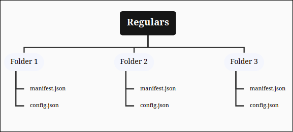

# Getting Started

The translations contain all messages/text that is displayed by ScpTools (excluding logs). It also comes with build in formatting code support.

## Creating a new translation



### Navigation

Navigate to .`/SCPToolsBot/lang/`



### Copy

Copy the `en_US` translation as a base



### Translate

Open up the translation and change everything except for the variables. Also make sure to leave all text that is surrounded like this `%var%` as is. You can use [markdown](https://support.discord.com/hc/en-us/articles/210298617-Markdown-Text-101-Chat-Formatting-Bold-Italic-Underline) and [#formatting-codes](getting-started.md#formatting-codes "mention")



### Rename

Rename your translation file like this: `language_Type`, e.g. de\_DE, en\_US, en\_UK



### Configure

Navigate to `./SCPToolsBot/configs/config.yml` and change load\_translation to your files name (excluding `.yml`). Find more configuration here [getting-started.md](../setup/getting-started.md "mention")



## Formatting Codes

| Color Code        | Display                                                                                                   | Function                                            |
| ----------------- | --------------------------------------------------------------------------------------------------------- | --------------------------------------------------- |
| `&dark_gray&`     | 
<figure><figcaption></figcaption></figure>
      | Apply the color gray                                |
| `&red&`           | 
<figure><figcaption></figcaption></figure>
  | Apply the color red                                 |
| `&green&`         | 
<figure><figcaption></figcaption></figure>
  | Apply the color green                               |
| `&gold&`          | 
<figure><figcaption></figcaption></figure>
  | Apply the color gold                                |
| `&light_blue&`    | 
<figure><figcaption></figcaption></figure>
  | Apply the color light blue                          |
| `&pink&`          | 
<figure><figcaption></figcaption></figure>
  | Apply the color pink                                |
| `&teal&`          | 
<figure><figcaption></figcaption></figure>
  | Apply the color teal                                |
| `&white&`         | 
<figure><figcaption></figcaption></figure>
  | Apply the color white                               |
| `&bold&`          | 
<figure><figcaption></figcaption></figure>
  | Apply bold                                          |
| `&reset&`         | 
<figure><figcaption></figcaption></figure>
  | Reset all colors, bold and underline                |
| `&underline&`     | 
<figure><figcaption></figcaption></figure>
 | Apply underline                                     |
| `&filler&`        | ---                                                                                                       | Fills up a whole row of an embed                    |
| `&singlefiller&`  | ---                                                                                                       | Adds a single empty character                       |
| `&filler<count>&` | ---                                                                                                       | Replace `<count>` with a number of blank characters |
